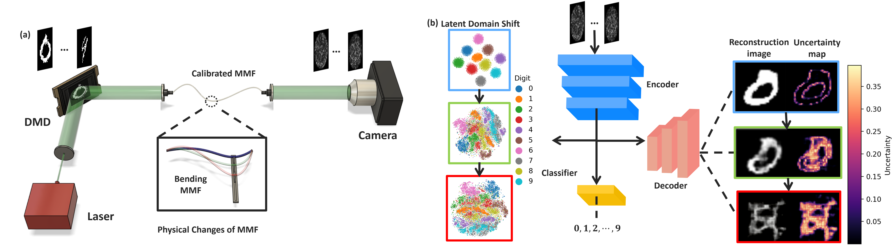
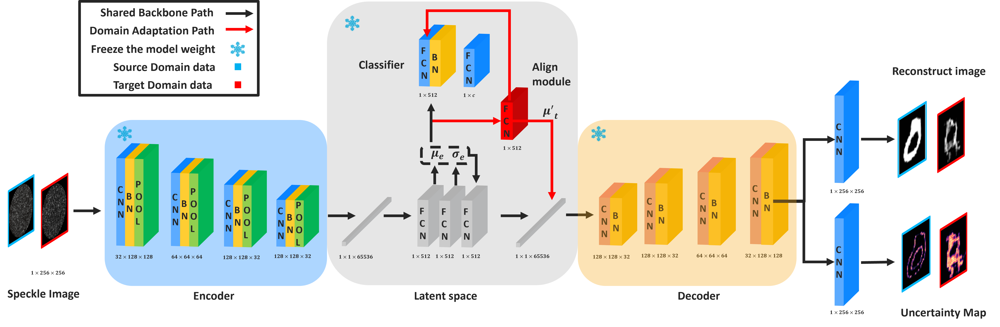
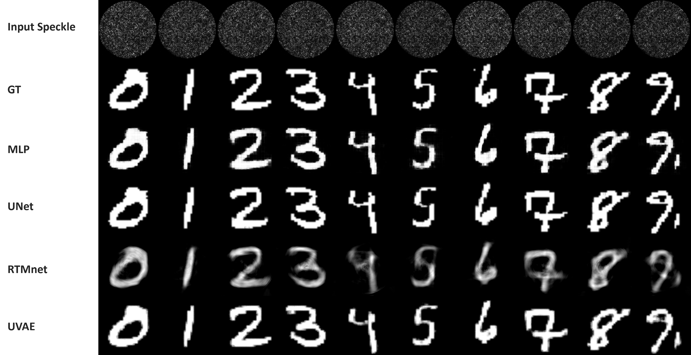
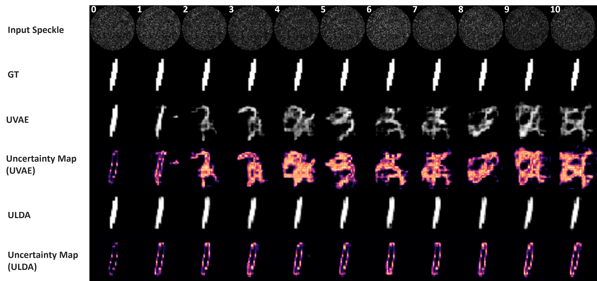

# Robust MMF Reconstruction via Uncertainty-Consistent Latent Domain Adaptation

Code accompanying the manuscript **"Robust Image Reconstruction through
Uncharacterized Multimode Fibers via Uncertainty-Consistent Latent Domain
Adaptation"**.

Bo Zhang, Donglai An, Yufei Wang, Lei Su, Jiawei Sun, and Pengfei Fan



*Figure 1. Multimode-fiber reconstruction under macroscopic bending. A
calibrated DMD-MMF-camera system is perturbed into uncharacterized physical
states, producing latent domain shift and degraded reconstruction reliability.*

## Overview

This repository contains the UVAE and ULDA training code used for robust image
reconstruction through dynamically perturbed multimode fibers (MMFs), together
with the deterministic baselines used in the manuscript.

Datasets, raw measurements, trained checkpoints, and large experiment outputs
are intentionally excluded. The code release is organized around the model
definitions, training objectives, reproduction scripts, and data interface
needed to run the experiments on local MMF measurements.

## Background

MMF-based imaging is sensitive to geometric perturbation. A fiber state that is
well calibrated at one time can become statistically mismatched after bending,
because modal interference and speckle statistics change even when the
projected object class is preserved. Static reconstruction models therefore
degrade under previously unseen bending states and provide little indication
of prediction reliability.

ULDA formulates this physical instability as a latent distribution-alignment
problem. A source-domain UVAE is trained on the calibrated fiber state to
predict both a reconstructed image and a pixel-wise aleatoric uncertainty map.
For each uncharacterized target bending state, the UVAE is frozen and only a
lightweight latent aligner is optimized using sparse category labels, source
prototypes, latent covariance alignment, and predictive uncertainty
consistency between matched DMD pattern IDs. Target-domain ground-truth images
are not used during adaptation; they are used only for offline evaluation.

## Method

For a measured speckle intensity image \(x\), the UVAE encoder parameterizes a
Gaussian latent posterior:

```text
q_phi(z | x) = N(mu_z, diag(sigma_z^2)).
```

The decoder predicts a heteroscedastic image likelihood:

```text
p_theta(y | z) = product_p N(mu_y,p(z), sigma_y,p^2(z)).
```

For a target bending state, ULDA applies a residual latent correction:

```text
z_aligned = z_t + A_psi(z_t),
```

and optimizes the adaptation objective:

```text
L_ULDA = lambda_p L_prototype
       + lambda_c L_covariance
       + lambda_y L_classification
       + lambda_u L_uncertainty
       + lambda_r L_regularization.
```

The uncertainty term is implemented as a symmetric Gaussian KL divergence
between decoded predictive distributions for source and target speckles that
share the same DMD pattern ID.



*Figure 2. ULDA framework. A frozen probabilistic reconstruction backbone is
combined with a compact residual latent aligner, allowing target-domain
adaptation without dense image supervision.*

## Code Organization

| Component | Main files | Purpose |
|---|---|---|
| UVAE backbone | `src/ulda_mmf/models/uvae.py`, `scripts/train_uvae.py` | Source-domain probabilistic reconstruction and latent organization |
| ULDA modules | `src/ulda_mmf/models/ulda.py`, `src/ulda_mmf/losses.py`, `scripts/train_ulda.py` | Compact latent adaptation without target-domain image labels |
| Continual ULDA reproduction | `scripts/train_ulda_continual.py` | Server-style reproduction of sequential bending-state adaptation |
| Ablation studies | `scripts/train_ulda_ablation.py` | Objective-component and module ablations |
| Data-efficiency studies | `scripts/train_ulda_data_efficiency_server.py` | Adaptation-epoch and reduced-label experiments across bending states |
| Baselines | `scripts/train_mlp.py`, `scripts/train_unet.py`, `scripts/train_rtmnet.py` | Deterministic reconstruction baselines |
| Documentation | `docs/DATA_FORMAT.md`, `docs/CODE_REVIEW.md`, `docs/IMPLEMENTATION_NOTES.md` | Data conventions and implementation notes |

The `src/ulda_mmf` package contains compact reusable modules. The
`scripts/` directory additionally includes self-contained server scripts that
mirror the experimental code path used for manuscript-scale runs.

## Installation

```bash
git clone https://github.com/acse-bz223/ULDA-MMF-Reconstruction.git
cd ULDA-MMF-Reconstruction
python -m pip install -e .
```

Python 3.10+ and PyTorch are recommended. RTMNet's optional image-domain
auxiliary loss requires a compatible `torch-radon` installation.

## Data Interface

The compact interface expects one directory per physical fiber state:

```text
data/
  bending0/
    speckles.npy
    images.npy
    labels.npy
    ids.npy
  bending1/
    speckles.npy
    labels.npy
    ids.npy
```

The historical reproduction scripts also recognize:

```text
data/
  bending0_sorted/
    speckles_sorted.npy
    images_sorted.npy
    labels_sorted.npy
```

In the historical format, `labels_sorted.npy` stores global DMD pattern IDs;
digit classes are inferred with `per_digit_hint`. See
`docs/DATA_FORMAT.md` for details.

## Reproduction

Train the calibrated UVAE backbone:

```bash
python scripts/train_uvae.py \
  --source data/bending0 \
  --output outputs/uvae/best.pt
```

Adapt to a target fiber state without reading target-domain images:

```bash
python scripts/train_ulda.py \
  --source data/bending0 \
  --target data/bending1 \
  --uvae_checkpoint outputs/uvae/best.pt \
  --output outputs/ulda/bending1.pt
```

Run the continual manuscript-style adaptation:

```bash
python scripts/train_ulda_continual.py \
  --data_root data/historical \
  --vae_ckpt outputs/uvae/best.pt \
  --initial_domain 0 --final_domain 10 \
  --use_class_bias --use_classwise_coral \
  --use_uncert_consistency --w_unc 0.5
```

Run the Supporting Information data-efficiency protocol:

```bash
python scripts/train_ulda_data_efficiency_server.py \
  --data_root data/historical \
  --vae_ckpt outputs/uvae/best.pt \
  --target_domains 1-10 \
  --epoch_checkpoints 0,1,5,10,20,50 \
  --fractions 0.01,0.05,0.10,0.25,0.50,1.00 \
  --experiments epoch,data --amp
```

The data-efficiency script writes `results_tables.md`, raw per-run CSV files,
mean-across-bending summaries, and the fixed split indices used for
evaluation.

## Baseline Results

Static reference-state performance reported in the manuscript:

| Model | Architecture | MSE (10^-3) | PSNR (dB) | SSIM (%) |
|---|---:|---:|---:|---:|
| MLP | Fully connected | 2.64 | 24.24 | 88.97 |
| U-Net | CNN encoder-decoder | 2.70 | 22.02 | 93.60 |
| RTMNet | Physics-informed | 2.15 | 20.34 | 86.24 |
| UVAE | Probabilistic VAE | 2.65 | **26.11** | **95.09** |

*Table 1. Reconstruction performance at the calibrated reference fiber state.*



*Figure 3. Qualitative comparison at the static reference state. The UVAE
backbone preserves digit structure while maintaining cleaner backgrounds than
the deterministic baselines.*

## ULDA Adaptation Results



*Figure 9. Qualitative restoration under bending. Static UVAE reconstructions
and uncertainty maps degrade under domain shift, whereas ULDA restores digit
structure and localizes predictive uncertainty.*

Adaptation trajectory averaged over target bending states \(b = 1,\ldots,10\)
using 8000 sparse target-label samples:

| Adaptation stage | MSE | PSNR (dB) | SSIM | Accuracy (%) |
|---|---:|---:|---:|---:|
| Static UVAE | 0.0918 | 10.66 | 0.650 | 13.29 |
| ULDA epoch 1 | 0.0983 | 10.37 | 0.595 | 39.59 |
| ULDA epoch 5 | 0.0630 | 12.44 | 0.689 | 92.96 |
| ULDA epoch 10 | 0.0481 | 13.71 | 0.737 | 98.32 |
| ULDA epoch 20 | 0.0338 | 15.31 | 0.794 | 99.26 |
| ULDA epoch 50 | **0.0231** | **16.99** | **0.844** | **99.26** |

*Table S5. ULDA adaptation trajectory from the Supporting Information.
Metrics are computed from the predictive mean. Target-domain ground-truth
images are used only for offline evaluation, not for adaptation.*

Reduced-label ULDA performance at epoch 50:

| Label fraction | Samples | MSE | PSNR (dB) | SSIM | Accuracy (%) |
|---:|---:|---:|---:|---:|---:|
| 1% | 80 | 0.0750 | 11.63 | 0.667 | 31.73 |
| 5% | 400 | 0.0584 | 12.82 | 0.703 | 70.72 |
| 10% | 800 | 0.0473 | 13.80 | 0.739 | 88.55 |
| 25% | 2000 | 0.0350 | 15.16 | 0.790 | 96.72 |
| 50% | 4000 | 0.0282 | 16.11 | 0.821 | 98.61 |
| 100% | 8000 | **0.0231** | **16.99** | **0.844** | **99.25** |

*Table S6. Reduced-label data-efficiency analysis averaged over target
bending states \(b = 1,\ldots,10\).*

## Reproducibility Notes

- The released code fixes the random seed to 42 by default.
- The reference-state split is 80% training, 10% validation, and 10% test.
- The data-efficiency experiments use fixed stratified target-domain splits.
- ULDA freezes the UVAE backbone and updates only the latent aligner and
  optional class-conditional bias.
- Target-domain images may be loaded by historical scripts for offline
  evaluation, but they are not included in the adaptation loss.
- No datasets, trained weights, or raw experiment outputs are distributed in
  this repository.

Release-level code review notes are available in `docs/CODE_REVIEW.md`.

## Citation

```bibtex
@article{zhang2026ulda,
  title   = {Robust Image Reconstruction through Uncharacterized Multimode
             Fibers via Uncertainty-Consistent Latent Domain Adaptation},
  author  = {Zhang, Bo and An, Donglai and Wang, Yufei and Su, Lei and
             Sun, Jiawei and Fan, Pengfei},
  year    = {2026}
}
```

## Acknowledgements

This work was supported by the President and Principal's Fund for Educational
Excellence at Queen Mary University of London, the National Natural Science
Foundation of China (Youth Program, No. 62505254), and the Natural Science
Foundation of Jiangsu Province (Youth Program, No. BK20240454).

## License

Code is released under the `MIT License`. Dataset and manuscript figure rights
are not granted by the software license.
