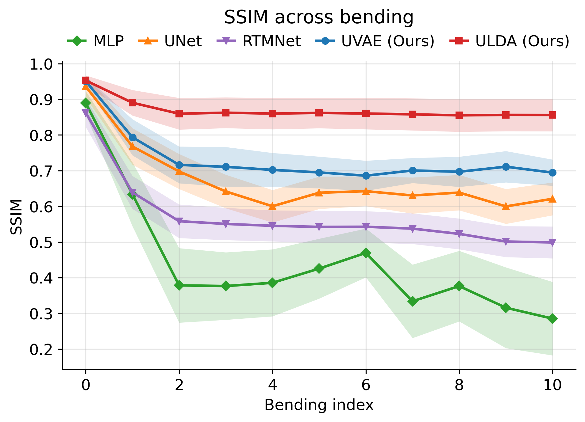
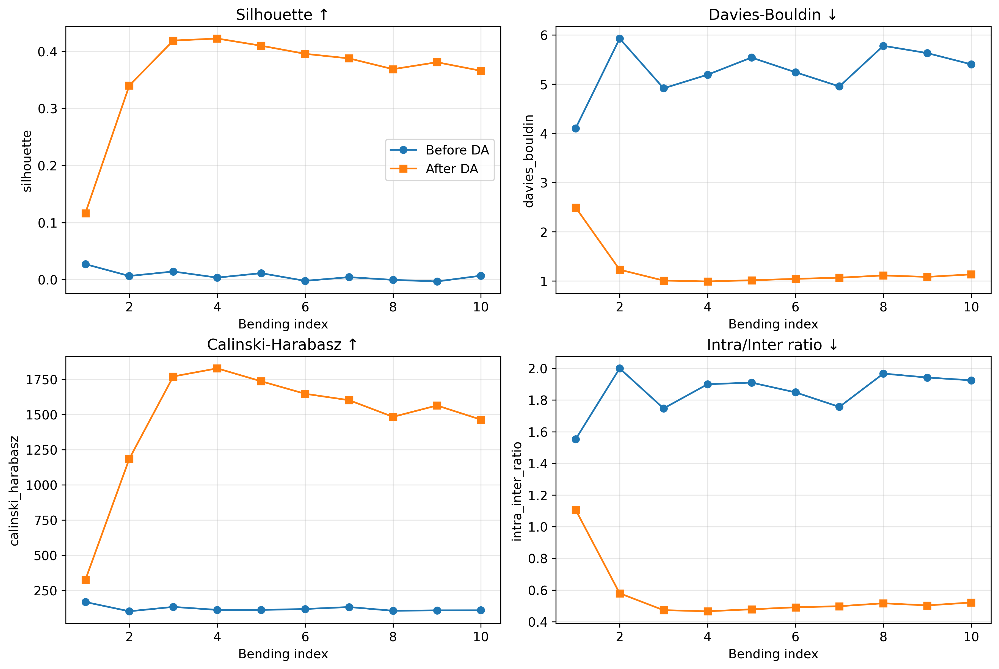
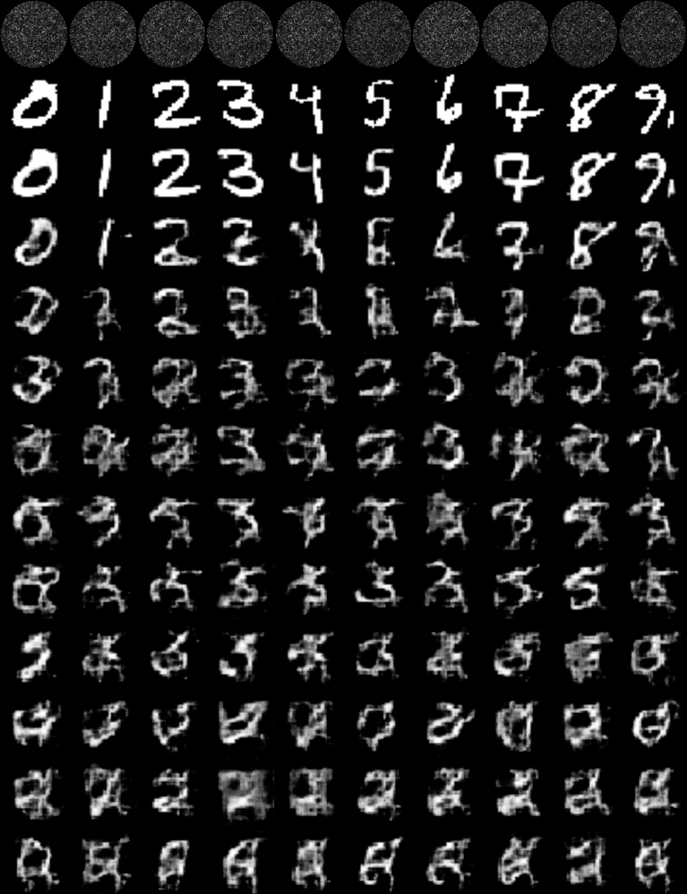
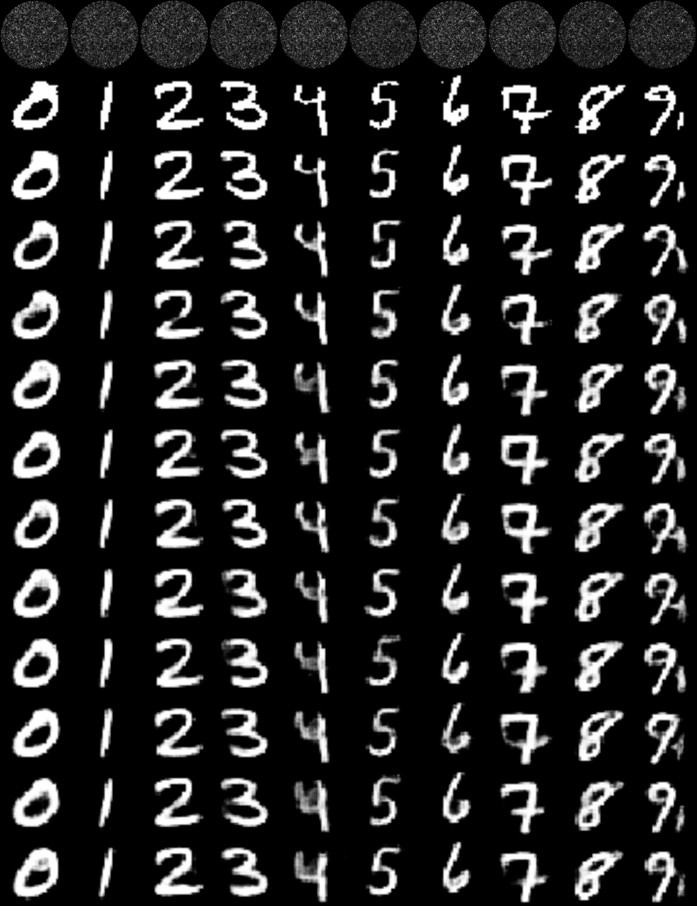

# Robust MMF Reconstruction via Uncertainty-Consistent Latent Domain Adaptation

Official research code for **"Robust Image Reconstruction through
Uncharacterized Multimode Fibers via Uncertainty-Consistent Latent Domain
Adaptation"**, prepared for *Laser & Photonics Reviews*.

Bo Zhang, Donglai An, Yufei Wang, Lei Su, Jiawei Sun, and Pengfei Fan

## Overview

Macroscopic bending changes multimode-fiber modal interference and produces a
severe physical domain shift. **ULDA** treats this perturbation as a displaced
latent manifold rather than repeatedly recalibrating a full image reconstructor.
A frozen uncertainty-aware variational autoencoder (**UVAE**) provides a
probabilistic semantic representation; a lightweight target-specific aligner is
then optimized using sparse labels, source prototypes, covariance alignment,
and uncertainty consistency between matched optical inputs.

Target-domain pixel-wise ground-truth images are **not used for ULDA
adaptation**. The repository intentionally excludes all experimental datasets
and trained weights.



*Reconstruction SSIM across the calibrated state and ten macroscopic bending
configurations. ULDA stabilizes structural fidelity under physical domain
shift; this project-generated plot corresponds to the comparative analysis in
the main manuscript.*

## Method

For a measured speckle pattern \(x\), UVAE learns a diagonal Gaussian latent
posterior and a heteroscedastic image likelihood:

```text
q(z|x) = N(mu_z, diag(sigma_z^2))
p(y|z) = product_p N(mu_y,p(z), sigma_y,p^2(z))
```

For target state \(b\), the frozen UVAE latent is corrected by a residual
aligner and a small class-conditional bias. The released ULDA objective
combines:

```text
L_ULDA = lambda_p L_prototype
       + lambda_c L_covariance
       + lambda_y L_classification
       + lambda_u L_uncertainty
       + lambda_o L_orthogonality
```

The uncertainty term is a symmetric Gaussian KL divergence between decoded
predictive distributions for source/target measurements sharing the same DMD
pattern ID.



*Latent geometry before and after adaptation. Higher silhouette and
Calinski-Harabasz scores, together with lower Davies-Bouldin and intra/inter
ratios, indicate recovery of a compact semantic manifold.*

## Included Code

| Component | Source | Training entry point |
|---|---|---|
| UVAE backbone | `src/ulda_mmf/models/uvae.py` | `scripts/train_uvae.py` |
| ULDA aligner and losses | `src/ulda_mmf/models/ulda.py`, `src/ulda_mmf/losses.py` | `scripts/train_ulda.py` |
| Continual ULDA reproduction | self-contained server implementation | `scripts/train_ulda_continual.py` |
| ULDA ablations | self-contained server implementation | `scripts/train_ulda_ablation.py` |
| ULDA data-efficiency study | self-contained server implementation | `scripts/train_ulda_data_efficiency.py` |
| MLP baseline | `src/ulda_mmf/models/baselines.py` | `scripts/train_mlp.py` |
| U-Net baseline | `src/ulda_mmf/models/baselines.py` | `scripts/train_unet.py` |
| RTMNet baseline | `src/ulda_mmf/models/rtmnet.py` | `scripts/train_rtmnet.py` |

The self-contained reproduction scripts are adapted from the server-side
training code used for the manuscript. The smaller `train_uvae.py` and
`train_ulda.py` interfaces are recommended for new datasets.

## Installation

```bash
git clone <repository-url>
cd ULDA-MMF-Reconstruction
python -m pip install -e .
```

Python 3.10+ and PyTorch 2.2+ are recommended. RTMNet's optional image-domain
auxiliary loss additionally requires a compatible installation of
`torch-radon`.

## Data

See [docs/DATA_FORMAT.md](docs/DATA_FORMAT.md). The modular interface expects
separate class labels and stable pattern IDs:

```text
data/bending0/{speckles.npy,images.npy,labels.npy,ids.npy}
data/bending1/{speckles.npy,labels.npy,ids.npy}
```

The manuscript reproduction scripts also support the historical
`bendingN_sorted/{speckles_sorted.npy,images_sorted.npy,labels_sorted.npy}`
layout, where `labels_sorted.npy` stores the global DMD pattern IDs.

## Training

Train the calibrated UVAE backbone:

```bash
python scripts/train_uvae.py \
  --source data/bending0 \
  --output outputs/uvae/best.pt
```

Adapt to a target fiber state without reading target-domain images:

```bash
python scripts/train_ulda.py \
  --source data/bending0 \
  --target data/bending1 \
  --uvae_checkpoint outputs/uvae/best.pt \
  --output outputs/ulda/bending1.pt
```

Run the continual manuscript configuration:

```bash
python scripts/train_ulda_continual.py \
  --data_root data/historical \
  --vae_ckpt outputs/uvae/best.pt \
  --initial_domain 0 --final_domain 10 \
  --use_class_bias --use_classwise_coral \
  --use_uncert_consistency --w_unc 0.5
```

Reproduce the Supporting Information studies:

```bash
python scripts/train_ulda_ablation.py --help
python scripts/train_ulda_data_efficiency.py --help
```

Train static baselines:

```bash
python scripts/train_mlp.py --data_root data/historical --bending_ids 0
python scripts/train_unet.py --data_root data/historical --bending_ids 0
python scripts/train_rtmnet.py --data_root data/sinograms --bend 0
```

## Representative Results

Static reference-state results reported in the manuscript:

| Model | Architecture | MSE (10^-3) | PSNR (dB) | SSIM (%) |
|---|---:|---:|---:|---:|
| MLP | Fully connected | 2.64 | 24.24 | 88.97 |
| U-Net | CNN encoder-decoder | 2.70 | 22.02 | 93.60 |
| RTMNet | Physics-informed | 2.15 | 20.34 | 86.24 |
| UVAE | Probabilistic VAE | 2.65 | **26.11** | **95.09** |

The SI data-efficiency experiment reports mean SSIM increasing from 0.650
before adaptation to 0.738 after one ULDA epoch and 0.862 after 50 epochs,
averaged over target bending states 1-10.

| Before ULDA | After ULDA |
|---|---|
|  |  |

*Extended reconstructions across bending configurations, corresponding to the
qualitative before/after analyses in Supporting Information Figures S2-S3.*

## Reproducibility Notes

- Fixed random seed: 42.
- Reference-state split: 80% training, 10% validation, 10% test.
- Default image resolution: 256 x 256.
- Default ULDA latent dimension: 512.
- ULDA updates the aligner and optional class bias while keeping UVAE frozen.
- Target images may be loaded by the historical scripts for offline evaluation,
  but are not included in their adaptation loss.

The review findings and corrections made while preparing this release are
documented in [docs/CODE_REVIEW.md](docs/CODE_REVIEW.md).

## Citation

```bibtex
@article{zhang2026ulda,
  title   = {Robust Image Reconstruction through Uncharacterized Multimode
             Fibers via Uncertainty-Consistent Latent Domain Adaptation},
  author  = {Zhang, Bo and An, Donglai and Wang, Yufei and Su, Lei and
             Sun, Jiawei and Fan, Pengfei},
  year    = {2026},
  note    = {Manuscript prepared for Laser \& Photonics Reviews}
}
```

## Acknowledgements

This work was supported by the President and Principal's Fund for Educational
Excellence at Queen Mary University of London, the National Natural Science
Foundation of China (Youth Program, No. 62505254), and the Natural Science
Foundation of Jiangsu Province (Youth Program, No. BK20240454).

## License

Code is released under the [MIT License](LICENSE). Dataset and manuscript
figure rights are not granted by the software license.
