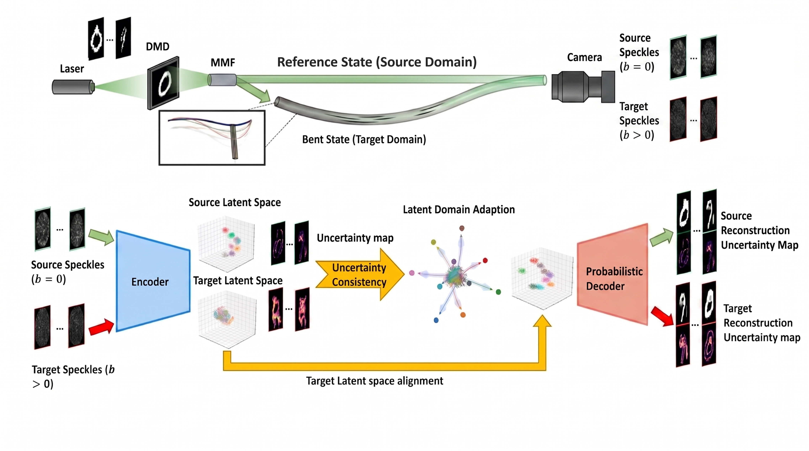
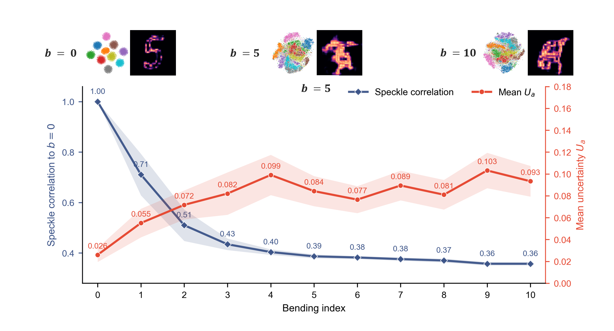
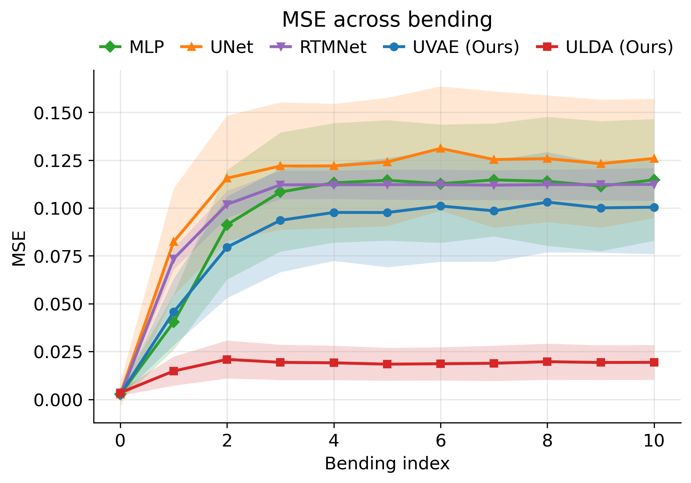
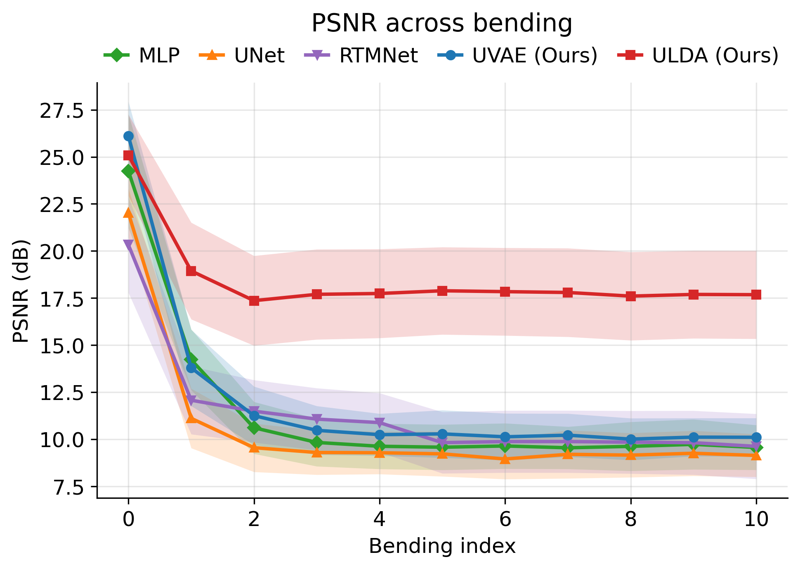
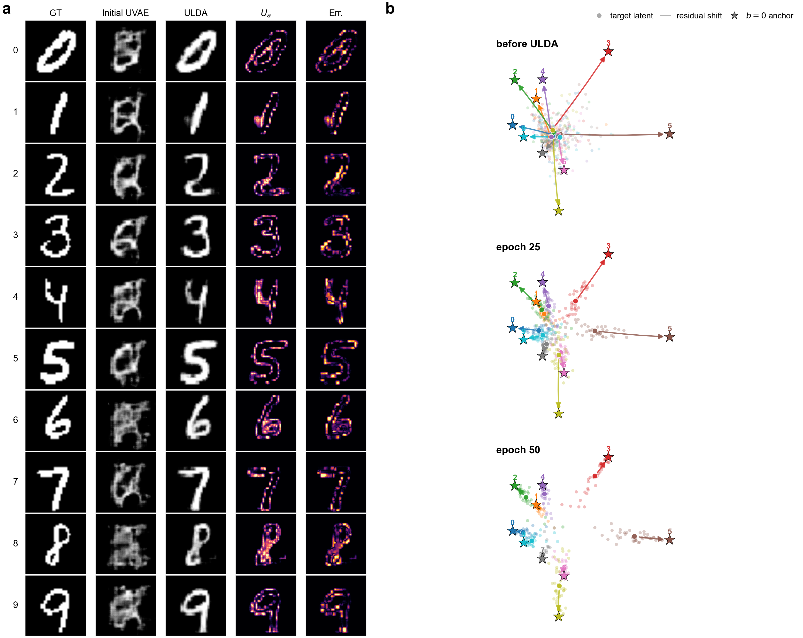
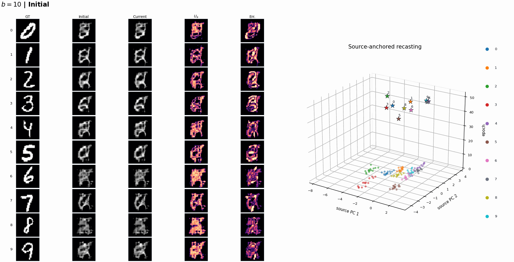

# Robust Image Reconstruction through Uncharacterized Multimode Fibers

Code accompanying the manuscript:

**Robust Image Reconstruction through Uncharacterized Multimode Fibers via Uncertainty-Consistent Latent Domain Adaptation**

Bo Zhang, Donglai An, Yufei Wang, Lei Su, Jiawei Sun, and Pengfei Fan

<p align="center">
  
</p>

**Figure 1. Experimental concept and uncertainty-consistent latent recasting.** Mechanical bending changes the multimode-fiber (MMF) transmission state, transforming calibrated source-domain speckles into target-domain measurements. In the learned inverse model, this physical perturbation appears as a displaced and mixed latent representation. ULDA keeps the uncertainty-aware UVAE backbone fixed and aligns target latents toward the calibrated source manifold using labels, DMD pattern IDs, and uncertainty consistency, without target-domain pixel-wise images.

## Overview

Multimode fibers can transmit rich spatial information through a thin optical waveguide, but their transmission is highly sensitive to bending. A reconstruction model calibrated at one fiber state receives a different speckle distribution after deformation, leading to a physical domain shift. This repository contains the source code used to study that problem and to implement uncertainty-consistent latent domain adaptation (ULDA).

The main idea is to treat bending-induced degradation as a latent-domain displacement rather than as a full loss of object information. A source-domain uncertainty-aware variational autoencoder (UVAE) is trained at the calibrated state (`b = 0`) to reconstruct images and estimate pixel-wise aleatoric uncertainty. For each target bending state, ULDA freezes the UVAE and updates only a compact latent aligner. Adaptation uses target labels, DMD pattern correspondences, and predictive uncertainty consistency; target-domain ground-truth images are reserved for offline evaluation.

This repository provides the model definitions, training scripts, baseline implementations, and data interface used for the manuscript-scale experiments. Raw datasets, trained checkpoints, and large experiment outputs are not distributed here.

## Method Summary

For a measured speckle image `x`, the UVAE encoder parameterizes a Gaussian latent posterior:

```text
q_phi(z | x) = N(mu_z(x), diag(sigma_z^2(x))).
```

The decoder predicts a heteroscedastic image likelihood:

```text
p_theta(y | z) = N(mu_y(z), diag(sigma_y^2(z))).
```

The predictive mean is used as the reconstruction, and the predicted variance is used as a pixel-wise uncertainty map. For a target bending state, ULDA applies a residual latent correction:

```text
z_aligned = z_t + R_psi(z_t) + B(c),
```

where `R_psi` is a compact residual aligner and `B(c)` is a class-conditional bias. The complete adaptation objective combines prototype alignment, covariance alignment, label consistency, uncertainty consistency, and residual regularization:

```text
L_ULDA = lambda_p L_proto
       + lambda_c L_cov
       + lambda_y L_cls
       + lambda_u L_uc
       + lambda_r L_reg.
```

The uncertainty-consistency term is implemented as a symmetric Gaussian KL divergence between decoded predictive distributions for source and target speckles with the same DMD pattern ID. In the manuscript implementation, only the residual aligner and class-bias module are updated, corresponding to approximately 0.52% of the UVAE backbone parameters.

<p align="center">
  
</p>

**Figure 2. ULDA architecture.** A frozen UVAE extracts latent features from target-domain speckles. A lightweight residual aligner maps perturbed target features toward the calibrated source manifold using labels, DMD pattern IDs, and uncertainty consistency. Target-domain pixel-wise images are not used for adaptation.

## Manuscript Results

### Bending-induced physical and latent shift

<p align="center">
  
</p>

**Figure 3. Bending-induced speckle decorrelation and uncertainty response.** Speckle correlation to the calibrated state decreases rapidly as the bending index increases, while the UVAE-predicted aleatoric uncertainty rises relative to the reference state. Representative latent embeddings and uncertainty maps show that bending broadens and mixes the target latent distribution, but does not fully remove class-related structure. This residual organization motivates latent recasting toward calibrated source anchors.

### Quantitative reconstruction performance

<p align="center">
  
  
  
</p>

**Figure 4. Reconstruction metrics under fiber bending.** MSE, PSNR, and SSIM are shown as functions of bending index for static MLP, U-Net, RTMNet, UVAE, and ULDA. Static models trained only at the calibrated state degrade under target-domain bending. ULDA stabilizes reconstruction fidelity by adapting the target latent representation while keeping the UVAE backbone fixed.

Static reference-state performance reported in the manuscript:

| Model | Architecture | MSE (10^-3) | PSNR (dB) | SSIM (%) |
|---|---:|---:|---:|---:|
| MLP | Fully connected | 2.64 | 24.24 | 88.97 |
| U-Net | CNN encoder-decoder | 2.70 | 22.02 | 93.60 |
| RTMNet | Physics-informed | **2.15** | 20.34 | 86.24 |
| UVAE | Probabilistic VAE | 2.65 | **26.11** | **95.09** |

MSE and PSNR are averaged over test samples independently. PSNR is computed per sample from the sample-wise MSE and then averaged across the test set.

### Uncertainty-consistent latent recasting

<p align="center">
  
</p>

**Figure 5. Latent recasting under strong bending.** Representative digit classes at `b = 10` compare the ground truth, the initial UVAE reconstruction, the ULDA reconstruction, the predicted uncertainty map, and the absolute reconstruction error. The source-anchor projection shows target latent samples before adaptation and after 25 and 50 adaptation epochs. Colored stars denote calibrated `b = 0` class anchors; arrows indicate residual displacement from target centroids toward the corresponding source anchors. ULDA progressively moves bent-state representations toward the calibrated semantic manifold while restoring image structure and uncertainty localization.

### Dynamic view

<p align="center">
  
</p>

**Dynamic ULDA adaptation at `b = 10`.** The animation tracks representative digit samples during adaptation. Reconstructions and uncertainty maps evolve together with the latent representation, illustrating how target features are recast toward the source-domain anchors while the frozen decoder returns to a more reliable operating regime.

## Code Organization

| Component | Main files | Purpose |
|---|---|---|
| UVAE backbone | `src/ulda_mmf/models/uvae.py`, `scripts/train_uvae.py` | Source-domain probabilistic reconstruction and uncertainty estimation |
| ULDA modules | `src/ulda_mmf/models/ulda.py`, `src/ulda_mmf/losses.py`, `scripts/train_ulda.py` | Lightweight target-domain latent adaptation |
| Continual adaptation | `scripts/train_ulda_continual.py` | Sequential bending-state adaptation used in server-scale runs |
| Ablations | `scripts/train_ulda_ablation.py` | Loss-component and module ablation studies |
| Data-efficiency studies | `scripts/train_ulda_data_efficiency_server.py` | Adaptation-epoch and reduced-label experiments |
| Baselines | `scripts/train_mlp.py`, `scripts/train_unet.py`, `scripts/train_rtmnet.py` | Deterministic reconstruction baselines |
| Documentation | `docs/DATA_FORMAT.md`, `docs/IMPLEMENTATION_NOTES.md`, `docs/CODE_REVIEW.md` | Data conventions and implementation notes |

The `src/ulda_mmf` package contains reusable model and loss components. The `scripts/` directory contains command-line training and reproduction scripts.

## Installation

```bash
git clone https://github.com/acse-bz223/ULDA-MMF-Reconstruction.git
cd ULDA-MMF-Reconstruction
python -m pip install -e .
```

Python 3.10+ and PyTorch are recommended. RTMNet's optional Radon-domain components require a compatible `torch-radon` installation.

## Data Interface

The compact interface expects one directory per physical fiber state:

```text
data/
  bending0/
    speckles.npy
    images.npy
    labels.npy
    ids.npy
  bending1/
    speckles.npy
    labels.npy
    ids.npy
```

The historical reproduction scripts also recognize:

```text
data/
  bending0_sorted/
    speckles_sorted.npy
    images_sorted.npy
    labels_sorted.npy
```

In the historical format, `labels_sorted.npy` stores global DMD pattern IDs, and digit classes are inferred with `per_digit_hint`. See `docs/DATA_FORMAT.md` for details.

## Reproduction

Train the calibrated UVAE backbone:

```bash
python scripts/train_uvae.py \
  --source data/bending0 \
  --output outputs/uvae/best.pt
```

Adapt to a target fiber state without using target-domain images:

```bash
python scripts/train_ulda.py \
  --source data/bending0 \
  --target data/bending1 \
  --uvae_checkpoint outputs/uvae/best.pt \
  --output outputs/ulda/bending1.pt
```

Run the continual manuscript-style adaptation:

```bash
python scripts/train_ulda_continual.py \
  --data_root data/historical \
  --vae_ckpt outputs/uvae/best.pt \
  --initial_domain 0 --final_domain 10 \
  --use_class_bias --use_classwise_coral \
  --use_uncert_consistency --w_unc 0.5
```

Run the Supporting Information data-efficiency protocol:

```bash
python scripts/train_ulda_data_efficiency_server.py \
  --data_root data/historical \
  --vae_ckpt outputs/uvae/best.pt \
  --target_domains 1-10 \
  --epoch_checkpoints 0,1,5,10,20,50 \
  --fractions 0.01,0.05,0.10,0.25,0.50,1.00 \
  --experiments epoch,data --amp
```

The data-efficiency script writes Markdown tables, CSV summaries, per-bending results, and the fixed split indices used for evaluation.

## Reproducibility Notes

- The released code fixes the random seed to 42 by default.
- The reference-state split is 80% training, 10% validation, and 10% test.
- ULDA freezes the UVAE backbone and updates only the latent aligner and optional class-conditional bias.
- Target-domain images are not included in the adaptation loss. They may be loaded by historical scripts only for offline evaluation.
- No datasets, trained weights, or raw measurement files are distributed in this repository.

Release-level code review notes are available in `docs/CODE_REVIEW.md`.

## Citation

```bibtex
@article{zhang2026ulda,
  title   = {Robust Image Reconstruction through Uncharacterized Multimode
             Fibers via Uncertainty-Consistent Latent Domain Adaptation},
  author  = {Zhang, Bo and An, Donglai and Wang, Yufei and Su, Lei and
             Sun, Jiawei and Fan, Pengfei},
  year    = {2026}
}
```

## Acknowledgements

This work was supported by the President and Principal's Fund for Educational Excellence at Queen Mary University of London, the National Natural Science Foundation of China (Youth Program, No. 62505254), and the Natural Science Foundation of Jiangsu Province (Youth Program, No. BK20240454).

## License

Code is released under the `MIT License`. Dataset and manuscript figure rights are not granted by the software license.
